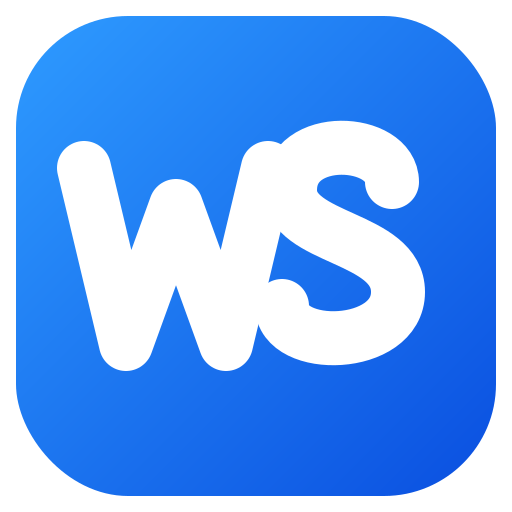

  

<h1 align="center">WorkSlop Desktop</h1>

  Customize your iPhone without a jailbreak — straight from your computer over USB. 
  Partial restore on iOS 26 · Full backup route on iOS 27.

  
  
  
  

# ⚠️ WARNING: DO NOT USE WORKSLOP DESKTOP v14 ON iOS 27 — IT CAN PUT YOUR iPHONE INTO A BOOTLOOP. v14 IS FOR iOS 26 ONLY. iOS 27 SUPPORT COMES IN THE NEXT BUILD.

---

## Download

The current release is **v14 (pre-release)** for Windows, macOS (Intel/ARM)
and Linux — CI builds one artifact per platform:

- `WorkSlopDesktop-Windows`
- `WorkSlopDesktop-macOS-Intel`
- `WorkSlopDesktop-macOS-ARM`
- `WorkSlopDesktop-Linux`
- `WorkSlopDesktop-Linux-ARM`

Grab it from the [Releases page](https://github.com/adnan120hz/WorkSlop-Desktop-Version/releases) — that page always carries the latest published build.

> [!WARNING]
> Always back up your iPhone before applying any tweak. Unexpected problems — including data loss — remain possible. Use this software at your own risk.

## Features

- **Liquid Glass tweaks** — the WorkSlop Liquid Glass set, including the S8 set for iOS 26.6.1. ⚠️ **S8 does not work**: it was tested on the developer's own iPhone (iOS 26.6.1) and Liquid Glass stayed fully active. Development of S8 has been abandoned — the author has given up on this feature. The option remains in the app unchanged, but do not rely on it.
- **Custom Icons** — a built-in iOS 18 Icons table (51 apps, Light/Dark) plus *Import Icon Pack (.zip)*. ✅ Proven working on the developer's own device on iOS 26.6.1.
- **Status Bar** — carrier text and status bar behavior options.
- **PosterBoard themes** — wallpaper/theme delivery (`.tendies` / `.batter`).
- **SpringBoard** — home screen and system behavior options.
- **Apple Internal** — internal/debug options for advanced users.
- **Passcode** — passcode theme options.
- **Daemons** — enable/disable system services.
- **Three interfaces** — WorkSlop (Main), WorkSlop 2, and a Nugget-style interface, switchable in Settings → Appearance.
- **Honest delivery routes** — Partial restore up to iOS 26; iOS 27 uses Full backup → modify → restore; the S8 set on iOS 26.6.1 uses a full backup of all data (delivery works; the S8 glass effect itself does not — see above).

Some options are version-gated and show as locked, with the reason, when a device does not support them. Test changes one at a time.

## How to use

1. Download the release ZIP above and extract it.
2. Run WorkSlop Desktop.
3. Connect your iPhone with a USB cable and tap **Trust** on the iPhone if asked.
4. **Turn off Find My** on the iPhone before any Apply or Reset — the device refuses the restore while it is on.
5. Pick your tweaks.
6. Hit **Apply** and restart the iPhone when the app asks.

On Windows, the [Apple Devices](https://apps.microsoft.com/detail/9np83lwlpz9k) app (or iTunes) must be installed so the iPhone can pair with the computer.

Questions and bug reports: [GitHub Issues](https://github.com/adnan120hz/WorkSlop-Desktop-Version/issues)

## Credits

**Developer:** Adnan.120hz

### Based on

WorkSlop Desktop is a fork of **GoldenNugget** by awesomenull, which is itself a fork of **Nugget** by leminlimez. Building on that foundation, we have upgraded and improved the underlying system, increased overall stability, added new features, and redesigned the user interface.

iOS 18 icon pack artwork by [catwithabaloon](https://github.com/catwithabaloon/iOS-18-icon-pack).

## License

WorkSlop Desktop is licensed under the **GNU Affero General Public License v3.0 (AGPL-3.0)**. See [LICENSE](LICENSE) for the full text.
