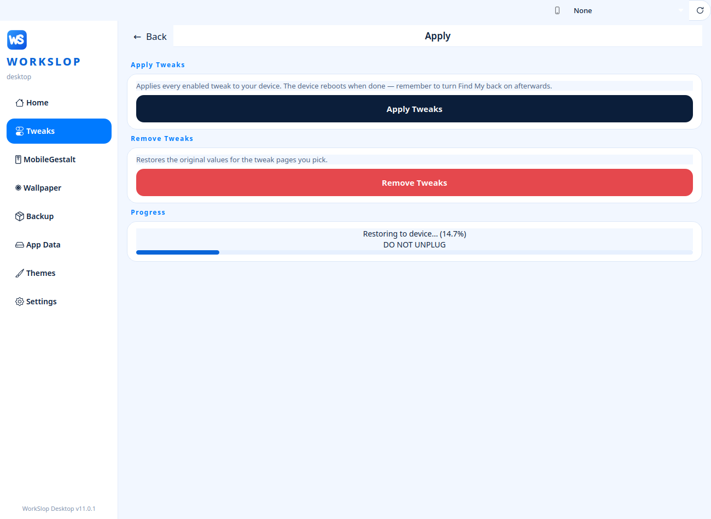
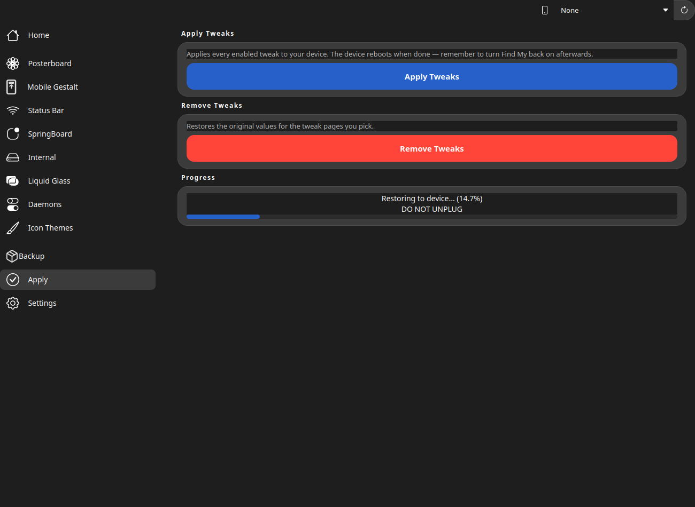

<p align="center">
  
</p>

<h1 align="center">WorkSlop Desktop</h1>

<p align="center">
  A desktop application for customizing iPhone settings and appearance without
  a jailbreak, over a USB connection. WorkSlop Desktop is built with PySide6
  and is derived from the GoldenNugget project.
</p>

<p align="center">
  <a href="LICENSE"></a>
  
  <a href="https://github.com/adnan120hz/WorkSlop-Desktop-Version/releases/latest"></a>
  <a href="https://github.com/adnan120hz/WorkSlop-Desktop-Version/releases"></a>
</p>

---

## Public Release

The current public release of WorkSlop Desktop is **v11.5**. It is available
for all three desktop platforms:

| Platform | Archive |
| --- | --- |
| Windows | `WorkSlopDesktop-v11.5-Windows.zip` |
| Linux (x86_64) | `WorkSlopDesktop-v11.5-Linux.tar.gz` |
| Linux (ARM64) | `WorkSlopDesktop-v11.5-Linux-aarch64.tar.gz` |
| macOS (Apple Silicon) | `WorkSlopDesktop-v11.5-macOS-AppleSilicon.zip` |
| macOS (Intel) | `WorkSlopDesktop-v11.5-macOS-Intel.zip` |
| macOS (Intel, legacy) | `WorkSlopDesktop-v11.5-macOS-IntelLegacy.zip` |

Download:
[github.com/adnan120hz/WorkSlop-Desktop-Version/releases/latest](https://github.com/adnan120hz/WorkSlop-Desktop-Version/releases/latest)

All earlier versions (v11.0.1 and below) predate the current public release and
several of them were published as pre-releases; v11.5 is the version
recommended for general use. **WorkSlop v12** is available as a Windows
pre-release (see the Releases page) with the new Liquid Glass Disable
full-backup route for iOS 26.6.1; macOS and Linux builds follow in the
next build round.

> [!WARNING]
> Always back up your iPhone before applying any tweak. WorkSlop Desktop
> includes protective-backup measures, but unexpected problems — including
> data loss — remain possible. Use this software at your own risk.

## What's New in v12

WorkSlop v12 (pre-release, Windows) focuses on one feature becoming
real instead of decorative:

- **Liquid Glass Disable full-backup route (iOS 26.6.1, builds
  23G82/23G83).** Applying G1/G2 now takes a complete device backup,
  writes the verified `SolariumForceFallback` payload into it, and
  restores that backup — with hard verification gates before anything
  touches the device (backup completeness, injection accounting,
  byte-exact payload re-read, G1 original-keys diff). Encrypted
  backups are refused, every failure cancels cleanly, and rollback
  rides the same route. The candidate key remains unproven — this
  release changes the delivery, not the claim.
- **Two Home tiles** for Liquid Glass Disable (G2 / G1) that open the
  feature page focused on the chosen route without enabling anything.
- Stability fixes on the Liquid Glass Disable page and its rollback
  store. No existing tweak payload changed.

See [CHANGELOG.md](CHANGELOG.md) for the full release history.

## Features

### Three interfaces

The interface can be switched at any time under **Settings → Appearance**:

- **WorkSlop (Main)** — the original WorkSlop interface.
- **WorkSlop 2** — the classic shell with WorkSlop icons and the blue/white
  WorkSlop identity.
- **Nugget** — the original Nugget look and layout; only the application name
  and icon are WorkSlop's.

### Customization areas

- Liquid Glass controls (a WorkSlop set, plus a 100%-Nugget set inside the
  Nugget-based interfaces)
- SpringBoard options
- Status Bar customization
- MobileGestalt flags
- Feature Flags
- Eligibility options
- Daemons and services control
- PosterBoard (wallpapers)
- Icon themes and passcode themes
- Full Backup and protective backup

<p align="center">
  
  
</p>

> [!NOTE]
> What any individual tweak does on a given iPhone depends on the iOS version
> and build installed. Some options are version-gated and are shown locked,
> with the reason, when a device does not support them. There is no guarantee
> that a particular tweak takes effect on every iOS version — make a backup
> before applying, and test changes one at a time.

## Getting Started

1. Download the archive for your platform from
   [Releases](https://github.com/adnan120hz/WorkSlop-Desktop-Version/releases/latest)
   and extract it.
2. Run the application.
3. Connect your iPhone with a USB cable and tap **Trust** on the iPhone when
   asked to trust this computer.
4. Create a backup (Full Backup recommended) before applying any tweak.
5. Enable the options you want, then use the **Apply** page.

Platform requirements:

- **Windows** — the [Apple Devices](https://apps.microsoft.com/detail/9np83lwlpz9k)
  app from the Microsoft Store, or iTunes from Apple's website.
- **macOS** — no additional software required.
- **Linux** — `usbmuxd` and `libimobiledevice`.

Questions and bug reports:
[GitHub Issues](https://github.com/adnan120hz/WorkSlop-Desktop-Version/issues)

### Running from source

```sh
pip install -r requirements.txt
python main_app.py
```

Python 3.10 or newer is required. To build a standalone binary:

```sh
pip install -r requirements.txt
python compile.py
```

## Changelog

### v12 — 2026-10-05 (pre-release, Windows)

- Liquid Glass Disable (Beta 1): new full-backup delivery route on
  iOS 26.6.1 (23G82/23G83) with hard verification gates; rollback
  included. Encrypted backups are refused; failures cancel before the
  device changes.
- Home: separate G1 and G2 tiles for Liquid Glass Disable.
- Liquid Glass Disable page/store stability fixes. No existing tweak
  payload changed.

### v11.5 — 2026-10-03

- Developer-beta warning names the detected iOS major version (iOS 27 beta
  devices no longer read "iOS 26 beta").
- The warning is non-modal and shown once per session per device; it no
  longer closes the app on Linux/Wayland.
- No tweak changes.

### v11.0.1 — 2026-10-03

- Backup folder is chosen in the system file picker when a Full Backup or
  Protective Backup starts (created automatically and remembered); the fixed
  "Backup Location" panel was removed.
- Live progress strip at the bottom of the Backup page.
- Themes and classic Apply pages color-matched to the Nugget interface.
- Apply progress log shown in all three interfaces.
- No tweak changes.

### v11.0 — 2026-10-03

- Three selectable interfaces: WorkSlop (Main), WorkSlop 2 and Nugget.
- Liquid Glass section rebuilt around the WorkSlop set restored verbatim to
  its v4 form, plus a separate 100%-Nugget Liquid Glass set in the
  Nugget-based interfaces.
- Eligibility and MobileGestalt options locked (fail-closed) on iOS 26.2
  beta 2 (build `23C5035e`) and newer; supported up to `23C5027f`.
- Backup stall watchdog on every backup path; new WorkSlop brand icon;
  beta tester team credited on the Home page.

[Full changelog](CHANGELOG.md)

## Credits

**Developer:** Adnan.120hz
([TikTok](https://www.tiktok.com/@adnan.120hz?_r=1&_t=ZS-9AElXliY2Me) ·
[GitHub](https://github.com/adnan120hz) ·
[Official Website](https://adnan120hz.vercel.app))

**UI reference:** Nugget UI

WorkSlop Desktop is based on
[GoldenNugget](https://github.com/GoldenNugget-Team/GoldenNugget) and
incorporates modules from [Nugget](https://github.com/leminlimez/Nugget) by
leminlimez.

Also credited: awesomenull · Wind0ws11Aero · PosterRestore ·
pymobiledevice3 · PySide6 · Quiet Daemon (Mikasa-san) · Snoolie ·
f1shy-dev · JJTech0130

**iOS 18 icon artwork (Custom Icons gallery):**
[iOS 18 App Icons by catwithabaloon](https://github.com/catwithabaloon/iOS-18-icon-pack)

**Beta tester team:** Charlie, rfrz1d_, Davy (@Davydavpn)

## License

WorkSlop Desktop is licensed under the **GNU Affero General Public License
v3.0 (AGPL-3.0)**. As a derivative of GoldenNugget, it remains under the same
license as its upstream. See [LICENSE](LICENSE) for the full text.
